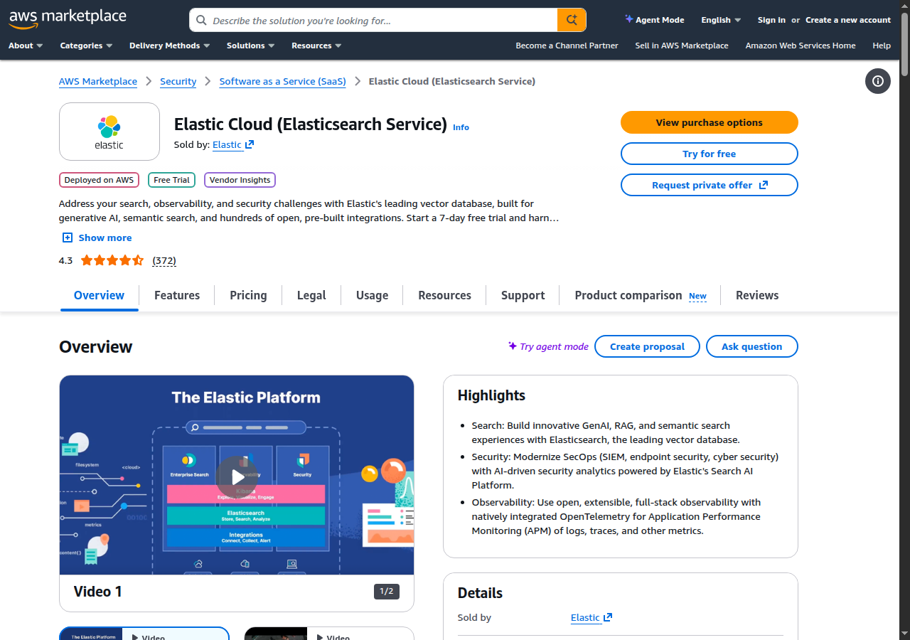
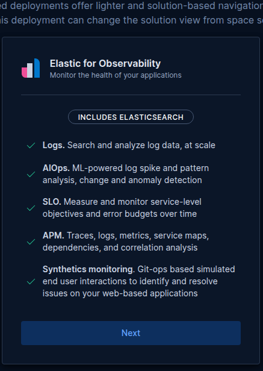
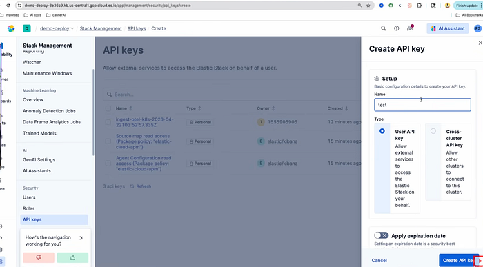
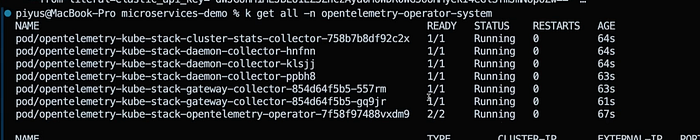
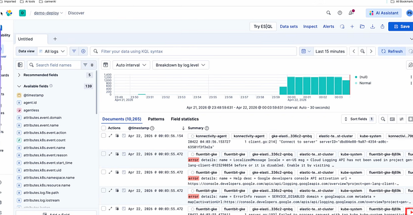
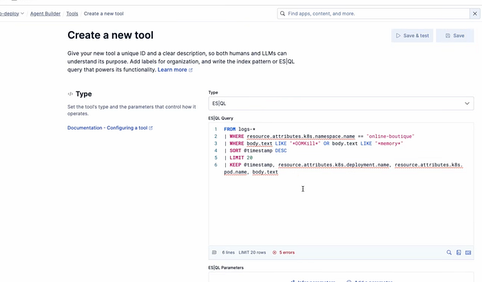
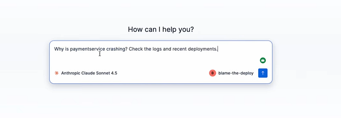

# Build an AI Observability Pipeline on EKS Using Elasticsearch

In this walkthrough, we will implement an end-to-end AI observability pipeline on Amazon EKS using Elastic Cloud and OpenTelemetry.

## What this pipeline actually does

An AI observability pipeline on EKS is a system that joins two streams of data — your crash logs and your deployment history — then lets a language model reason over the join. The result is a chat-style root cause: *"paymentservice went OOMKilled three minutes after commit a1b2c3 by xyz, which dropped the memory limit from 128Mi to 24Mi."*

Two indices, one agent, that's all it needs.

You were in deep sleep (but an on-call SRE). A pod hits `CrashLoopBackOff` at 2am. You woke up with the beep of your pager. You start the usual triaging: tail logs, `kubectl describe`, scroll Git history, and ask in Slack whether anyone shipped anything. By the time you find the culprit, forty minutes have gone, and you have woken up your tech lead.

This walkthrough shows how to skip that loop. You will connect OpenTelemetry, Elasticsearch, and ArgoCD with your EKS cluster so that one question — *"Why is paymentservice crashing?"* — gets back a real answer: the commit SHA, the author, what they changed, and what to revert.

---

## Table of contents

- [Architecture](#architecture)
- [Prerequisites](#prerequisites)
- [Step 1: Provision Elasticsearch from AWS Marketplace](#step-1-provision-elasticsearch-from-aws-marketplace)
- [Step 2: Configure OpenTelemetry to ship Kubernetes logs](#step-2-configure-opentelemetry-to-ship-kubernetes-logs)
- [Step 3: Index Git commit metadata via GitHub Actions](#step-3-index-git-commit-metadata-via-github-actions)
- [Step 4: Set up Argo CD for GitOps deployment](#step-4-set-up-argo-cd-for-gitops-deployment)
- [Step 5: Build the AI diagnostic agent in Elastic](#step-5-build-the-ai-diagnostic-agent-in-elastic)
- [Step 6: Simulate and diagnose a crash](#step-6-simulate-and-diagnose-a-crash)
- [Why this works](#why-this-works)
- [FAQs](#faqs)

---

## Architecture

<!-- IMAGE PLACEHOLDER: Architecture diagram of AI observability setup on EKS using Elasticsearch -->
> **[Add AWS/EKS architecture diagram here]**

Two data flows meet inside Elasticsearch.

The **infrastructure side**: you push code, ArgoCD syncs it to EKS, a pod crashes, and OpenTelemetry ships the crash event to the `logs-*` index.

The **metadata side**: the same push fires a GitHub Action that POSTs commit details (SHA, author, diff URL, and message) to the index `github-deployments`.

The Elastic AI agent owns both queries. When you ask a question, it runs an ES|QL query against the logs to find the failure, runs a second query against deployments to find the most recent push, and stitches the answer together in plain English.

A few setup gotchas are worth flagging before you start.

- Push your Kubernetes manifests to GitHub **before** you create the ArgoCD app. ArgoCD syncs whatever is in the repo at first sync, and an empty repo means a long debugging detour.
- Elastic Cloud has to exist **before** you install OpenTelemetry, because the OTel chart wants the endpoint and API key at install time.
- Create the `github-deployments` index **before** you push to a repo that already has the workflow file. The first push will try to write straight away.
- Both indices need real data before you turn on the agent. The agent cannot reason over nothing.

---

## Prerequisites

Make sure you have the below tools installed on your machine:

- AWS CLI (`aws`)
- Kubernetes CLI (`kubectl`)
- `eksctl` (for EKS cluster management)
- Helm
- ArgoCD CLI
- GitHub CLI (`gh`) and Git

Connect `kubectl` to your EKS cluster:

```bash
aws eks update-kubeconfig \
  --region us-east-1 \
  --name <CLUSTER_NAME>
```

Verify nodes are healthy:

```bash
kubectl get nodes
# Expect: 3 nodes, Status: Ready
```

One sizing note that will save you a Slack message later: use `m5.xlarge` instances, not `t3.medium`. You are running 12 microservices, OTel DaemonSets, and ArgoCD on the same cluster. Two vCPUs per node will not cut it. Three `m5.xlarge` nodes is the sweet spot.

If you don't have an EKS cluster yet, spin one up quickly:

```bash
eksctl create cluster \
  --name demo-cluster \
  --region us-east-1 \
  --nodegroup-name standard-workers \
  --node-type m5.xlarge \
  --nodes 3 \
  --nodes-min 3 \
  --nodes-max 5 \
  --managed
```

---

## Step 1: Provision Elasticsearch from AWS Marketplace

You could self-host Elasticsearch. You shouldn't — at least not for this. The Marketplace deployment lands on the same AWS invoice and handles upgrades for you. (A free trial is sufficient for our demo.)

1. Open the [AWS Console](https://console.aws.amazon.com) and navigate to **AWS Marketplace**.
2. Search for **Elastic Cloud (Elasticsearch Service)**.



3. Subscribe, then click **Set up your account**. That kicks you over to the Elastic Cloud console.
4. In the Elastic portal, click **Create Serverless deployment**.
5. Choose **Elastic for Observability**. This template pre-enables the bits you need: log aggregation, APM, and AIOps. The plain Elasticsearch template means turning those on later by hand.
6. Set the cloud provider to **Amazon Web Services**, region to **us-east-1**, name the deployment `demo-deploy`, and click **Create deployment**.

Provisioning takes about five minutes. When the credentials screen appears, copy the `elastic` user password.

### Get your endpoints

From the Elastic Cloud console, open your deployment and grab these two:

1. **Elasticsearch → Copy endpoint** — used with GitHub Actions secret `ES_ENDPOINT` and `curl` commands.
2. **Integrations → Manage → APM → copy OTLP endpoint** — used as the OTel kube-stack secret `elastic_otlp_endpoint`.

### Step 1b: Generate a Kibana API key

You will need one API key in two places (the OTel install and your GitHub repo secrets), so generate it now.

Navigate to:

```
https://<YOUR-KIBANA-URL>/app/management/security/api_keys
```

Or via the menu: **Kibana → ☰ → Stack Management → Security → API Keys**.

Click **Create API key**, name it something obvious like `github-deploy-key`, and click **Create**.



Copy the key. Same rule as the password: shown once. You will reuse it as:
- `elastic_api_key` in the OTel secret (Step 2)
- `ES_API_KEY` in your GitHub repo secrets (Step 3)

Verify the key works:

```bash
curl -s -w "\nHTTP:%{http_code}" \
  -X GET "<YOUR-ES-ENDPOINT>" \
  -H "Authorization: ApiKey <YOUR-API-KEY>"
# Expect: HTTP:200
```

If you do not get a 200, fix that now. A bad key here causes OTel to silently drop logs later, and you will spend an hour wondering why Discover is empty.

---

## Step 2: Configure OpenTelemetry to ship Kubernetes logs

OpenTelemetry is the bridge between your cluster and Elasticsearch. Once it is installed as a DaemonSet, every pod log in the cluster gets shipped automatically. You do not have to instrument individual services for this tutorial.

1. In Elastic, open your deployment and click **Add Observability Data**.
2. Choose **Kubernetes**.
3. Under **Monitor your Kubernetes cluster using**, pick **OpenTelemetry: Full Observability**.

Elastic pre-fills the Helm commands with your endpoint and credentials.

Add the Helm repo:

```bash
helm repo add open-telemetry \
  https://open-telemetry.github.io/opentelemetry-helm-charts --force-update
```

Create the namespace, secret, and chart:

```bash
kubectl create namespace opentelemetry-operator-system

kubectl create secret generic elastic-secret-otel \
  --namespace opentelemetry-operator-system \
  --from-literal=elastic_otlp_endpoint='<YOUR-OTLP-INGEST-ENDPOINT>' \
  --from-literal=elastic_api_key='<YOUR-API-KEY>'

helm upgrade --install opentelemetry-kube-stack \
  open-telemetry/opentelemetry-kube-stack \
  --namespace opentelemetry-operator-system \
  --values 'https://raw.githubusercontent.com/elastic/elastic-agent/refs/tags/v9.3.3/deploy/helm/edot-collector/kube-stack/managed_otlp/values.yaml' \
  --version '0.12.4'
```

If Helm complains about a conflict, run `helm uninstall opentelemetry-kube-stack -n opentelemetry-operator-system` and reinstall. This happens to everyone the first time.

Verify all pods came up:

```bash
kubectl get all -n opentelemetry-operator-system
```



### Step 2b: Verify logs are flowing in Kibana

Before you wire up anything else, confirm OTel is actually shipping logs. Open Kibana and go to **Discover**. The Kibana URL is on the Elastic Cloud deployment overview page, listed next to the Elasticsearch endpoint.

In Discover, pick the **All logs** data view, set the time range to **Last 15 minutes**, and look for documents arriving from your EKS pods. You should see system components, OTel collectors, and any applications running on the cluster.



If you see documents, you are good. If not, double-check the API key and the OTLP endpoint in the secret.

> **EKS-specific note:** If you're using a private EKS cluster (no public endpoint), ensure the OTel collector pods can reach the Elastic endpoint. You may need to add a NAT Gateway or VPC endpoint for outbound HTTPS traffic on port 443.

---

## Step 3: Index Git commit metadata via GitHub Actions

The agent answers "Who deployed this?" by querying a second index. That index needs to be populated. A GitHub Action handles that automatically on every push. Nothing runs inside your cluster for this part; Actions runs in GitHub's cloud and POSTs straight to Elasticsearch.

### 3a. Create the index

```bash
curl -X PUT "<YOUR-ES-ENDPOINT>/github-deployments" \
  -H "Authorization: ApiKey <YOUR-API-KEY>" \
  -H "Content-Type: application/json" \
  -d '{
    "mappings": {
      "properties": {
        "timestamp":   { "type": "date" },
        "commit_sha":  { "type": "keyword" },
        "author":      { "type": "keyword" },
        "service":     { "type": "keyword" },
        "image_tag":   { "type": "keyword" },
        "change":      { "type": "text" },
        "diff_url":    { "type": "keyword" }
      }
    }
  }'
# Expect: {"acknowledged":true}
```

### 3b. Add GitHub repository secrets

```bash
gh secret set ES_ENDPOINT \
  --repo <YOUR-GITHUB-USERNAME>/<YOUR-REPO> \
  --body "<YOUR-ES-ENDPOINT>"

gh secret set ES_API_KEY \
  --repo <YOUR-GITHUB-USERNAME>/<YOUR-REPO> \
  --body "<YOUR-API-KEY>"
```

### Step 3c: The workflow file

Create `.github/workflows/index-deploy.yml`. On every push to `main`, it figures out which service changed (by diffing `release/kubernetes-manifests.yaml`) and POSTs one document to the `github-deployments` index.

```yaml
name: Index deployment to Elasticsearch
on:
  push:
    branches: [main]

jobs:
  index:
    runs-on: ubuntu-latest
    steps:
      - uses: actions/checkout@v4
        with:
          fetch-depth: 2

      - name: Detect changed service
        id: changed
        run: |
          CHANGED=$(git diff HEAD~1 HEAD -- release/kubernetes-manifests.yaml \
            | grep '^+' \
            | grep -oP 'name:\s+\K[a-z][a-z0-9-]+service' \
            | head -1)
          if [ -z "$CHANGED" ]; then
            CHANGED=$(git diff HEAD~1 HEAD -- release/kubernetes-manifests.yaml \
              | grep -oE 'paymentservice|cartservice|frontend|recommendationservice|adservice|checkoutservice|productcatalogservice|currencyservice|shippingservice|emailservice|redis-cart|loadgenerator' \
              | head -1)
          fi
          echo "service=${CHANGED:-unknown}" >> $GITHUB_OUTPUT

      - name: Push deploy event to Elasticsearch
        run: |
          curl -X POST "${{ secrets.ES_ENDPOINT }}/github-deployments/_doc" \
            -H "Authorization: ApiKey ${{ secrets.ES_API_KEY }}" \
            -H "Content-Type: application/json" \
            -d "{
              \"timestamp\":  \"$(date -u +%Y-%m-%dT%H:%M:%SZ)\",
              \"commit_sha\": \"${{ github.sha }}\",
              \"author\":     \"${{ github.actor }}\",
              \"service\":    \"${{ steps.changed.outputs.service }}\",
              \"image_tag\":  \"${{ github.sha }}\",
              \"change\":     \"${{ github.event.head_commit.message }}\",
              \"diff_url\":   \"${{ github.event.compare }}\"
            }"
```

### Step 3d: Verify it works

```bash
git commit --allow-empty -m "test: verify ES indexing"
git push origin main

gh run list --limit 3
# Expect: "Index deployment to Elasticsearch" → completed success

curl -s "<YOUR-ES-ENDPOINT>/github-deployments/_count" \
  -H "Authorization: ApiKey <YOUR-API-KEY>"
# Expect: {"count":1,...}
```

---

## Step 4: Set up Argo CD for GitOps deployment

Argo CD watches your repo and syncs changes to EKS on a schedule. The whole point of the demo is to push code and have it deploy automatically. Argo CD is what makes that real.

```bash
# Install ArgoCD
kubectl create namespace argocd
kubectl apply -n argocd \
  -f https://raw.githubusercontent.com/argoproj/argo-cd/stable/manifests/install.yaml
kubectl rollout status deployment/argocd-server -n argocd --timeout=180s

# Expose publicly via LoadBalancer (creates an AWS ELB)
kubectl patch svc argocd-server -n argocd \
  -p '{"spec":{"type":"LoadBalancer"}}'
kubectl get svc argocd-server -n argocd
# Note the EXTERNAL-IP (AWS ELB hostname)

# Get admin password
kubectl get secret argocd-initial-admin-secret -n argocd \
  -o jsonpath='{.data.password}' | base64 -d && echo ""

# Log in
argocd login <EXTERNAL-IP> --username admin --password <PASSWORD> --insecure
```

> **Note:** On EKS, the `EXTERNAL-IP` for the LoadBalancer will be an AWS ELB DNS hostname (e.g., `xxxxxx.us-east-1.elb.amazonaws.com`), not a plain IP. Use that hostname wherever `<EXTERNAL-IP>` appears.

Feel free to use [this sample repo](https://github.com/GoogleCloudPlatform/microservices-demo) as your application.

Create the ArgoCD application pointing at your repo:

```bash
kubectl apply -f - <<EOF
apiVersion: argoproj.io/v1alpha1
kind: Application
metadata:
  name: online-boutique
  namespace: argocd
spec:
  project: default
  source:
    repoURL: https://github.com/<YOUR-USERNAME>/microservices-demo
    targetRevision: main
    path: release
  destination:
    server: https://kubernetes.default.svc
    namespace: online-boutique
  syncPolicy:
    automated:
      prune: true
    syncOptions:
      - CreateNamespace=true
EOF
```

Trigger the first sync. The default ArgoCD poll interval is three minutes, which is fine in production and brutal in a demo. Drop it to thirty seconds so you can actually watch things happen.

```bash
argocd app sync online-boutique --force --prune

kubectl patch configmap argocd-cm -n argocd --type merge \
  -p '{"data": {"timeout.reconciliation": "30s"}}'
kubectl rollout restart deployment/argocd-repo-server -n argocd

# Verify all 12 pods are running
kubectl get pods -n online-boutique
```

---

## Step 5: Build the AI diagnostic agent in Kibana

Both indices are live. Now build the agent that queries them.

### Step 5a: LLM setup

The agent needs a language model behind it. Use **Elastic Inference Service (EIS)**.

EIS ships with Elastic for Observability deployments and Marketplace trials, and the model dropdown is already populated when you create an agent.

You will see Claude for reasoning, JINA embeddings for vectorization, and the JINA reranker for retrieval ordering. All pre-wired, all billed through your Elastic invoice, no second vendor to onboard. Pick Claude (or whichever reasoning model you prefer) for the agent itself.

You will want the JINA models the moment you extend this pattern to semantic search over logs or RAG over runbooks — and there is no faster way to get a working reranker into the loop than the one that already lives next to your data.

If EIS is genuinely not available on your deployment, fall back to an external connector:

> **Kibana → ☰ → Stack Management → Connectors → Create connector → OpenAI**
>
> Paste an API key from `platform.openai.com`, set the model to `gpt-4o`, click **Save & test**, then pick the connector in Agent Builder.

Anthropic, Google Vertex, and AWS Bedrock connectors follow the same shape. Pick whichever you already have billing set up for.

### Step 5b: Create the ES|QL tools

**Kibana → ☰ → Search → Tools → Create tool.**

**Tool 1: `get_crash_logs`**

- Type: Elasticsearch query
- Index: `logs-*`

```esql
FROM logs-*
| WHERE resource.attributes.k8s.namespace.name == "online-boutique"
| WHERE body.text LIKE "*OOMKill*" OR body.text LIKE "*memory*"
| SORT @timestamp DESC
| LIMIT 20
| KEEP @timestamp, resource.attributes.k8s.deployment.name, resource.attributes.k8s.pod.name, body.text
```



**Tool 2: `get_deploy_history`**

- Type: Elasticsearch query
- Index: `github-deployments`

```esql
FROM github-deployments
| SORT timestamp DESC
| LIMIT 5
| KEEP timestamp, author, commit_sha, service, change, diff_url
```

### Step 5c: Create the agent

**Kibana → ☰ → Search → Agent Builder → Create agent.**

- **Name:** `blame-the-deploy`
- **Model:** Claude, or your configured connector

Paste these instructions:

```
You are an SRE assistant. When asked why a service is crashing:
1. Use get_crash_logs to find OOMKill or memory events in logs-*
2. Use get_deploy_history to find the most recent GitHub deployment to that service
3. If the deploy happened shortly before the crash, that is the likely cause
4. Report: crash time, commit SHA, author, what changed, and how to fix it
Always cite the commit SHA and author name in your answer.
```

Under **Tools**, add `get_crash_logs` and `get_deploy_history` and click save.

---

## Step 6: Simulate and diagnose a crash

The whole reason you built this is to ask the agent a hard question. So break something on purpose.

### Introduce the bad commit

Open `release/kubernetes-manifests.yaml`. Find the `paymentservice` deployment (around line 631) and squeeze the memory limits below what the service actually needs at startup:

```yaml
resources:
  requests:
    memory: "24Mi"   # was 64Mi
  limits:
    memory: "24Mi"   # was 128Mi
```

```bash
git add release/kubernetes-manifests.yaml
git commit -m "perf: tune paymentservice memory limits for cost optimisation"
git push origin main
```

That commit message is the kind of thing a tired engineer actually writes at 4pm on a Friday. ArgoCD picks it up within thirty seconds and applies the manifest. Because 24Mi is not enough, the pod dies on startup.

```bash
kubectl get pods -n online-boutique -w
# paymentservice: Running → OOMKilled → CrashLoopBackOff
```

Confirm which pod is unhappy:

```bash
kubectl describe pod -n online-boutique <pod-name> | grep -A5 'Last State\|OOM'
```

### Ask the agent

Open the Elastic Agent chat:

> *Why is paymentservice crashing? Check the logs and recent deployments.*



The agent runs `get_crash_logs`, sees the OOMKill, runs `get_deploy_history`, finds the commit that lowered the memory limit, and reports back with the SHA, the author, the commit message, the diff URL, and a fix suggestion.



### Fix it

```bash
git revert HEAD --no-edit
git push origin main
# Pod recovers in about 30 seconds
```

Ask the agent again:

> *Is paymentservice healthy now?*

It checks the logs, finds no recent OOMKills, and confirms the service is stable.

---

## Why this works

It comes down to the join. Kubernetes logs tell you what crashed and when. The `github-deployments` index tells you what was deployed and by whom. Either index alone leaves you guessing. Stitch them together behind an agent and you skip the part of the incident where you are bouncing between CloudWatch, GitHub, Slack, and `kubectl`.

The pattern extends. Want to diagnose CPU throttling? Add a tool that searches `logs-*` for `CPUThrottlingHigh` events. Want to catch failed health checks? Same idea with a different ES|QL clause. The tools are just saved queries, and the agent picks up a new diagnostic capability the next time you chat with it.

One caveat before you put this in front of the rest of your team. The agent is good at **correlation**, not causation. If two services deploy in the same five-minute window and one crashes, the agent will cheerfully blame the wrong commit. Treat the output as a strong lead, not a verdict.

---

## Quick reference

### Commands you will reuse

```bash
kubectl get pods -n online-boutique        # check all pods
kubectl get pods -n online-boutique -w     # watch live
kubectl get pods -n opentelemetry-operator-system  # check OTel
argocd app get online-boutique             # ArgoCD sync status
argocd app sync online-boutique --force    # force sync
```

### ES|QL: find OOMKill events

```esql
FROM logs-*
| WHERE resource.attributes.k8s.namespace.name == "online-boutique"
| WHERE body.text LIKE "*OOMKill*"
| SORT @timestamp DESC
| LIMIT 20
| KEEP @timestamp, resource.attributes.k8s.deployment.name, body.text
```

### ES|QL: find recent deploys

```esql
FROM github-deployments
| SORT timestamp DESC
| LIMIT 10
| KEEP timestamp, author, commit_sha, service, change
```

---

## FAQs

**What is an AI observability pipeline?**

An AI observability pipeline is a system that ships infrastructure telemetry and deployment metadata into the same data store, then puts an LLM in front of it so you can ask plain-English questions about failures. The model runs structured queries against your indices instead of asking you to remember which dashboard goes with which symptom.

**Can I run this without AWS?**

Yes. The architecture is portable. Swap EKS for GKE, AKS, or any conformant Kubernetes cluster. Elasticsearch has hosted offerings on GCP and Azure Marketplace, and OpenTelemetry does not care which cloud it runs on. The only AWS-specific steps are the Marketplace billing flow and the `aws eks update-kubeconfig` command, both of which you can swap for their cloud-equivalent.

**Why use Elasticsearch for this use case?**

Elasticsearch gives you the ability to manage your logs, metrics, deployment events, and vector embeddings in the same place. The Kibana AI agent is built in. You define a tool, point it at an index, and chat with it. No LangChain wrapper, no FastAPI orchestrator, no model gateway to keep alive. And ES|QL is one query language across logs, metrics, and structured JSON metadata — which is the only reason the join in this tutorial (`logs-*` against `github-deployments`) is five lines instead of a Python service.

**How much does this cost to run?**

A small Elastic Cloud deployment on `us-east-1` runs about $95 per month at the time of writing. EKS costs depend on node count; three `m5.xlarge` nodes are roughly $210 per month before Savings Plans or Reserved Instance discounts. The EKS control plane itself is $0.10/hour (~$73/month). If you are running this as a learning exercise, tear the cluster down between sessions using `eksctl delete cluster --name demo-cluster --region us-east-1`.

**My GitHub action fires, but no document lands in Elasticsearch. What now?**

Check three things in this order. First, do the repo secrets resolve? Add `echo "endpoint length: ${#ES_ENDPOINT}"` to the workflow to verify. Second, does the API key have write permission on `github-deployments`? Test with `curl -X POST` from your laptop using the same key. Third, is your `ES_ENDPOINT` value missing the `https://` prefix? That one bites everyone.

**Can the Kibana AI agent fix the bug or just identify it?**

For this tutorial, it identifies. It does not open a pull request or call `kubectl rollout undo` on your behalf. You can extend it to do that with a custom tool that wraps the GitHub API or `kubectl`, but I would rather you read the diagnosis first and decide. Autonomous remediation in production is a separate conversation.

**Does this replace my on-call runbooks?**

No. It collapses the first ten minutes of an incident — the part where you are hunting for the right tab. The runbook still tells you what to do once you know what broke. Think of the agent as the on-call's first responder, not the surgeon.

**What IAM permissions does my EKS cluster need?**

The OTel DaemonSet only needs outbound HTTPS to the Elastic endpoint; no AWS-specific IAM permissions are required. If your EKS nodes use an instance profile, ensure the security group allows outbound 443. ArgoCD similarly needs no special AWS permissions — it operates against the Kubernetes API only.

---

## References

- [Elastic Cloud on AWS Marketplace](https://aws.amazon.com/marketplace/pp/prodview-vgghgvfmxdzvg)
- [OpenTelemetry Helm Charts](https://open-telemetry.github.io/opentelemetry-helm-charts)
- [ArgoCD Documentation](https://argo-cd.readthedocs.io/en/stable/)
- [eksctl — EKS cluster management](https://eksctl.io/)
- [Elastic ES|QL Reference](https://www.elastic.co/guide/en/elasticsearch/reference/current/esql.html)
- [Elastic Agent Builder](https://www.elastic.co/guide/en/kibana/current/search-ai-assistant.html)
