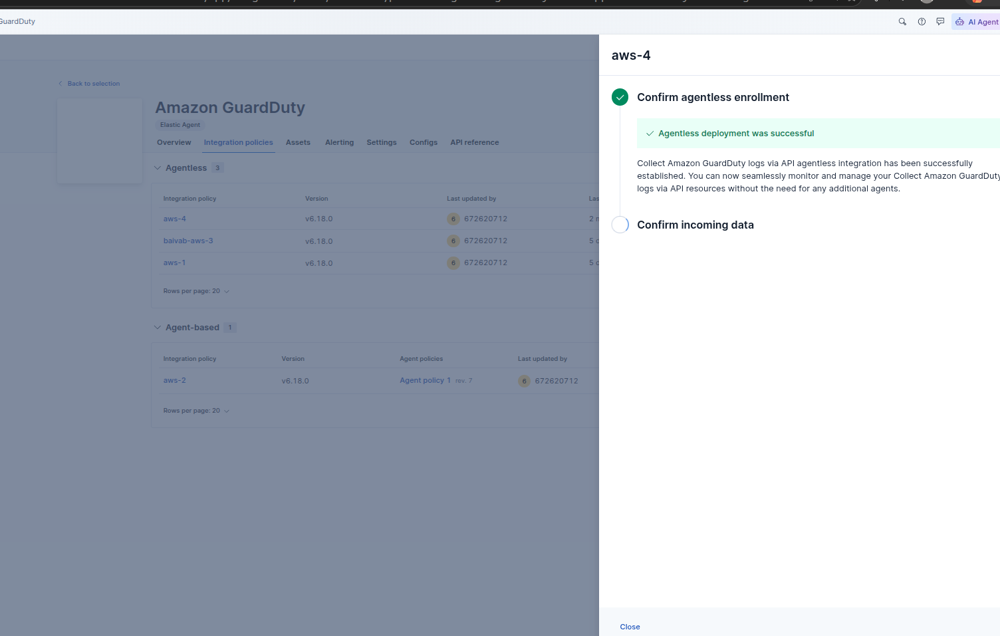
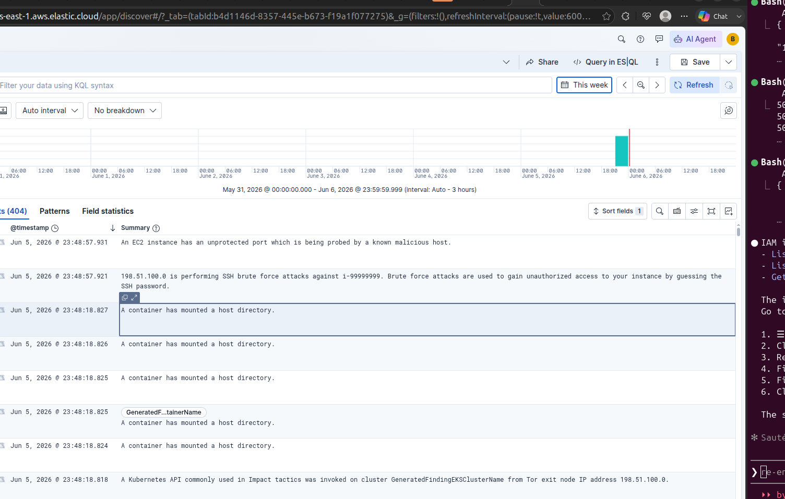

# Detect S3 Threats in Real Time with Amazon GuardDuty and Elastic Cloud

Your S3 buckets hold your most sensitive data — database backups, user uploads, application configs. AWS GuardDuty watches those buckets continuously and fires a finding the moment something looks wrong: an unusual IP pulling objects at 3am, a root account touching production data, an API call from a Tor exit node.

The problem is GuardDuty findings stay inside the AWS console by default. This walkthrough ships them into Elastic Cloud so you can search, correlate, and alert across every finding from every account in one place — with no agent to manage.

---

## Why Elastic when GuardDuty already has a console?

This is a fair question. The GuardDuty console does show you findings — so why add another tool?

**GuardDuty is a detector, not an investigation platform.** It tells you something happened. Elastic is where you figure out what it means, how serious it is, and what else was going on at the same time.

| Capability | GuardDuty Console | Elastic Cloud |
|---|---|---|
| View findings | Yes | Yes |
| Search with custom queries | Basic filters only | Full KQL / ES\|QL |
| Multiple AWS accounts in one view | No | Yes |
| Correlate with app logs, VPC flow, k8s | No | Yes |
| Custom dashboards | No | Yes |
| AI-powered investigation assistant | No | Yes |
| Alert to Slack, PagerDuty, email | Via EventBridge only | Built-in |
| Retain findings beyond 90 days | **No — auto-deleted** | Yes, indefinitely |
| Compliance audit trail | No | Yes |

The 90-day limit is the critical one. **GuardDuty automatically purges findings older than 90 days.** If you get breached and need to investigate what happened 4 months ago — that data is gone from GuardDuty. In Elastic, it lives as long as you keep it.

**Think of it this way:** GuardDuty is the smoke detector. Elastic is the security operations center that receives the alarm, pulls the camera footage, checks who badged in, and decides whether to call the fire department.

---

## What you will build

```
Amazon GuardDuty (S3 Protection enabled)
  └── Elastic GuardDuty Integration (agentless, polls API every 1m)
        └── Kibana: search findings, dashboards, alerts
```

One agentless integration — Elastic calls the GuardDuty API directly using an IAM user. Zero servers, zero agents, zero infrastructure to manage.

---

## Table of contents

- [Prerequisites](#prerequisites)
- [Step 1: Provision Elastic Cloud from AWS Marketplace](#step-1-provision-elastic-cloud-from-aws-marketplace)
- [Step 2: Generate an Elastic API Key](#step-2-generate-an-elastic-api-key)
- [Step 3: Enable GuardDuty and S3 Protection](#step-3-enable-guardduty-and-s3-protection)
- [Step 4: Create an IAM User for Elastic](#step-4-create-an-iam-user-for-elastic)
- [Step 5: Configure the GuardDuty Integration in Kibana](#step-5-configure-the-guardduty-integration-in-kibana)
- [Step 6: Generate Sample Findings to Test the Pipeline](#step-6-generate-sample-findings-to-test-the-pipeline)
- [Step 7: Explore Findings in Kibana](#step-7-explore-findings-in-kibana)
- [What findings to watch for](#what-findings-to-watch-for)
- [FAQs](#faqs)

---

## Prerequisites

- An AWS account (GuardDuty 30-day free trial available)
- AWS CLI configured (`aws configure`)
- A browser

---

## Step 1: Provision Elastic Cloud from AWS Marketplace

1. Open the [AWS Console](https://console.aws.amazon.com) and navigate to **AWS Marketplace**.
2. Search for **Elastic Cloud (Elasticsearch Service)** and open the listing.


3. Click **View purchase options** — Elastic Cloud is usage-based with no upfront commit and a free trial included.


4. Click **Subscribe** → **Set up your account**. You will land on the Elastic Cloud login page with a banner confirming the AWS billing link is active.


5. Your AWS Marketplace agreement shows **Active**. Click **Set up your account** to continue.


6. In the Elastic Cloud portal, click **Create serverless project**.


7. Select **Elastic for Observability**.


8. Name the project `guardduty-demo`, set the cloud provider to **Amazon Web Services**, choose the same region as your GuardDuty detector (e.g. `us-east-1`), and click **Create**. When provisioning completes, click **Open project**.


9. On the project overview, note your **Elasticsearch endpoint** for reference.


---

## Step 2: Generate an Elastic API Key

In Kibana, navigate to **☰ → Stack Management → Security → API Keys → Create API key**.

Name it `guardduty-integration`, then expand **Control security privileges** and paste this JSON to scope the key to only what the integration needs:

```json
{
  "indices": [
    {
      "names": ["logs-aws.guardduty-*", ".logs-aws.guardduty-*"],
      "privileges": ["auto_configure", "create_doc"]
    }
  ],
  "cluster": ["monitor"]
}
```

This gives the key write access to GuardDuty log indices and basic cluster monitoring — nothing more.


Click **Create API key** and copy the encoded value immediately — it is shown only once.

---

## Step 3: Enable GuardDuty and S3 Protection

### 3a. Enable GuardDuty

```bash
# Enable GuardDuty
aws guardduty create-detector \
  --enable \
  --region us-east-1 \
  --finding-publishing-frequency FIFTEEN_MINUTES

# Save the Detector ID — you will need it in Step 5
DETECTOR_ID=$(aws guardduty list-detectors \
  --region us-east-1 \
  --query 'DetectorIds[0]' \
  --output text)
echo "Detector ID: $DETECTOR_ID"
```

### 3b. Enable S3 Protection

S3 Protection tells GuardDuty to monitor all API calls to your S3 buckets — detecting policy misconfigurations, unusual access patterns, and data exfiltration attempts.

```bash
aws guardduty update-detector \
  --detector-id $DETECTOR_ID \
  --region us-east-1 \
  --data-sources '{"S3Logs":{"Enable":true}}'

# Verify
aws guardduty get-detector \
  --detector-id $DETECTOR_ID \
  --region us-east-1 \
  --query 'DataSources.S3Logs'
# Expect: {"Status": "ENABLED"}
```

> **Placeholder:** Add a screenshot of the GuardDuty console showing S3 Protection status **Enabled**.

---

## Step 4: Create an IAM User for Elastic

The agentless integration polls the GuardDuty API directly using IAM credentials. Create a least-privilege user with only the permissions it needs.

### 4a. Create the user

```bash
aws iam create-user --user-name elastic-guardduty-reader
```

### 4b. Attach the policy

```bash
aws iam put-user-policy \
  --user-name elastic-guardduty-reader \
  --policy-name ElasticGuardDutyReadOnly \
  --policy-document '{
    "Version": "2012-10-17",
    "Statement": [
      {
        "Sid": "GuardDutyAPIRead",
        "Effect": "Allow",
        "Action": [
          "guardduty:GetFindings",
          "guardduty:ListFindings",
          "guardduty:GetDetector",
          "guardduty:ListDetectors"
        ],
        "Resource": "*"
      }
    ]
  }'
```

> **Why `Resource: *` for GuardDuty?** Most GuardDuty API actions (including `ListFindings`) operate on sub-resources like `detector/<id>/findings`. AWS does not support resource-level restrictions for these actions, so `*` is required — it is still least-privilege because the actions themselves are read-only.

### 4c. Generate access keys

```bash
aws iam create-access-key \
  --user-name elastic-guardduty-reader \
  --query 'AccessKey.{KeyId:AccessKeyId,Secret:SecretAccessKey}' \
  --output table
```

**Save the KeyId and Secret immediately** — the secret is shown only once. You will enter these in Step 5.

> **Tip:** If you lose the secret, delete the key and create a new one:
> ```bash
> aws iam delete-access-key --user-name elastic-guardduty-reader --access-key-id <KeyId>
> aws iam create-access-key --user-name elastic-guardduty-reader
> ```

---

## Step 5: Configure the GuardDuty Integration in Kibana

### 5a. Find the integration

1. In Kibana, go to **☰ → Add Observability data → Cloud → AWS → View collection**.


2. Search for **aws guard** in the integration search box. Click **Amazon GuardDuty**.


3. On the integration overview page, click **Add Amazon GuardDuty**.


### 5b. Fill in the form

**Integration settings**

| Field | Value |
|---|---|
| Integration name | `guardduty-demo` |
| Description | *(optional)* |

**AWS credentials**

| Field | Value | Where to get it |
|---|---|---|
| Access Key ID | *(from Step 4c)* | Output of `aws iam create-access-key` |
| Secret Access Key | *(from Step 4c)* | Shown once at key creation — save it |
| Session Token | *(leave blank)* | Only needed for temporary STS credentials |


**Deployment options** — select **Agentless (Beta)**


**Collect Amazon GuardDuty logs via API** — toggle **ON**, turn OFF the "via S3 or SQS" toggle

| Field | Value | Notes |
|---|---|---|
| Interval | `1m` | How often Elastic polls GuardDuty |
| Initial Interval | `24h` | How far back to pull on first run |
| **Detector ID** | *(your detector ID)* | Get it with the command below |
| **AWS Region** | `us-east-1` | Region where GuardDuty is enabled |
| Preserve original event | OFF | Turn ON only if you need the raw JSON |

**Get your Detector ID:**

```bash
aws guardduty list-detectors --region us-east-1 --query 'DetectorIds[0]' --output text
```

Or in the AWS Console: **GuardDuty → Settings** — the Detector ID is at the top of the page.

Here is the fully populated form:


### 5c. Save and deploy

Click **Save and continue**. Elastic provisions the agentless collector and confirms enrollment:



---

## Step 6: Generate Sample Findings to Test the Pipeline

GuardDuty needs time to establish baselines before it fires real findings. Use `create-sample-findings` to immediately inject synthetic findings and verify data is flowing into Kibana:

```bash
DETECTOR_ID=$(aws guardduty list-detectors --region us-east-1 --query 'DetectorIds[0]' --output text)

aws guardduty create-sample-findings \
  --detector-id $DETECTOR_ID \
  --region us-east-1

echo "~40 sample findings injected — wait 1 minute then check Kibana"
```

This creates ~40 findings covering every GuardDuty finding type (EC2, IAM, S3, Kubernetes, etc.). They use reserved documentation IPs like `198.51.100.0` and generated resource names like `GeneratedFindingEKSClusterName` — clearly synthetic, will not trigger real alerts.

Within 1 minute the integration polls the API and findings appear in Kibana.

---

## Step 7: Explore Findings in Kibana

### 7a. Create a data view

Go to **☰ → Stack Management → Data Views → Create data view**.

- **Name**: `GuardDuty Findings`
- **Index pattern**: `logs-aws.guardduty-*`
- **Timestamp field**: `@timestamp`

Click **Save data view to Kibana**.


### 7b. Open Discover

Go to **☰ → Discover**, select the **GuardDuty Findings** data view, and set the time range to **Last 24 hours**.

Each document is one GuardDuty finding — severity, finding type, affected resource, source IP, and AWS account all searchable.



### Useful KQL queries

**High and critical severity findings only:**
```kql
aws.guardduty.severity >= 7
```

**All S3-related findings:**
```kql
aws.guardduty.type: *S3*
```

**Findings from a specific bucket:**
```kql
aws.guardduty.resource.s3BucketDetails.name: "my-sensitive-bucket"
```

**Access from Tor exit nodes:**
```kql
aws.guardduty.type: *TorIPCaller*
```

**Exclude sample/test findings:**
```kql
NOT aws.guardduty.service.additionalInfo.sample: true
```

---

## What findings to watch for

| Finding type | What it means | Severity |
|---|---|---|
| `Policy:S3/BucketBlockPublicAccessDisabled` | Someone turned off block public access | Medium |
| `Stealth:S3/ServerAccessLoggingDisabled` | Logging disabled — attacker covering tracks | Medium |
| `UnauthorizedAccess:S3/TorIPCaller` | S3 access from Tor exit node | High |
| `Discovery:S3/BucketEnumeration` | Someone listing your buckets | Low–Medium |
| `Exfiltration:S3/ObjectRead.Unusual` | Unusual object access pattern | High |
| `Impact:S3/ObjectDelete.Unusual` | Mass deletions — potential ransomware | High |
| `CredentialAccess:S3/AnomalousBehavior` | Credential anomaly accessing S3 | High |

Set a **Kibana threshold alert** on `aws.guardduty.severity >= 7` with a 5-minute window to get paged immediately on high-severity findings.

---

## FAQs

**Is this truly agentless?**

Yes. The Elastic GuardDuty integration on Elastic Cloud Serverless is fully agentless — Elastic manages the collector. No EC2, no Lambda, nothing to patch.

**How soon do findings appear?**

GuardDuty generates findings within minutes of detecting a threat. With the integration set to `1m` poll interval, end-to-end latency is under 2 minutes.

**How much does GuardDuty cost?**

GuardDuty S3 Protection is ~$0.40 per 1M S3 API calls monitored. A 30-day free trial is available for new accounts. Elastic Cloud Serverless pricing depends on ingest volume.

**Can I monitor multiple AWS accounts?**

Yes. Enable GuardDuty in each account and create a separate integration policy in Kibana for each detector ID. All findings land in the same `logs-aws.guardduty-*` index and are distinguishable by `cloud.account.id`.

**What if I already use GuardDuty but haven't enabled S3 Protection?**

Run the `update-detector` command from Step 3b against your existing detector ID. S3 Protection activates immediately with no service disruption.

---

## References

- [Elastic Amazon GuardDuty Integration](https://www.elastic.co/docs/reference/integrations/aws/guardduty)
- [Elastic Agentless Integrations list](https://www.elastic.co/docs/reference/integrations/agentless_integrations)
- [AWS GuardDuty S3 Protection docs](https://docs.aws.amazon.com/guardduty/latest/ug/s3-protection.html)
- [GuardDuty finding types reference](https://docs.aws.amazon.com/guardduty/latest/ug/guardduty_finding-types-active.html)
- [Elastic Cloud on AWS Marketplace](https://aws.amazon.com/marketplace/pp/prodview-voru33wi6xs7k)
